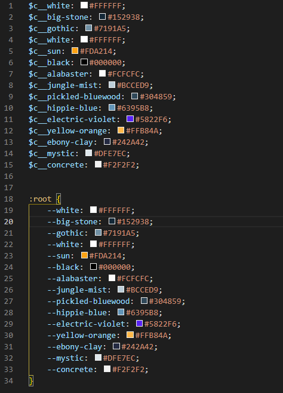

# copy the figma colors


## Why 

I wasn't patient enough to copy color by color and I wasn't creative enough to come up with new color names for my CSS variables. So I made this basic script to help me

## How to use

1. Copy the script.js content from this repository
2. Open figma in your browser and access your target project
3. Select the layer you want to collect the colors
4.In the "Selection colors" section, click "See all colors" to make all the colors used in the project visible
5. Open your browser console
6. Paste the code and hit enter.
7. Okay, now just copy the text that appeared on the console and put it in your project


## modify it your way

In the code that is added to finalCode you can modify it in your own way, adding or removing things, making it compatible with native CSS variables and all that. In the code that is added to finalCode you can modify it in your own way, adding or removing things, making it compatible with native CSS variables and all that.


```
function generateColors() {

    let finalCode = ''

    for (let color of colors) {
        let code = color.querySelector('input').value

        let name = ntc.name(code)[1].replace(' ', '-').toLowerCase()

        finalCode += `$c__${name}: #${code};`


    }
    return finalCode
}

```
In this example I left the code compatible for the vanila variables of the css:

```
function generateColors() {

    let finalCode = `:root {`

    for (let color of colors) {
        let code = color.querySelector('input').value

        let name = ntc.name(code)[1].replace(' ', '-').toLowerCase()

        finalCode += `--${name}: #${code};`


    }

    finalCode += '}'

    return finalCode
}

```


## Reference 

-  to find out the color names I used the [ntc.js](https://chir.ag/projects/ntc/) library


## future additions

- turn this into a browser plugin 
- Automatically copy the texts
- Automatically format text explicitly
- Automatically select layers and click the see more colors button

If you know how to implement any of these things, think about contributing to the project 😀

